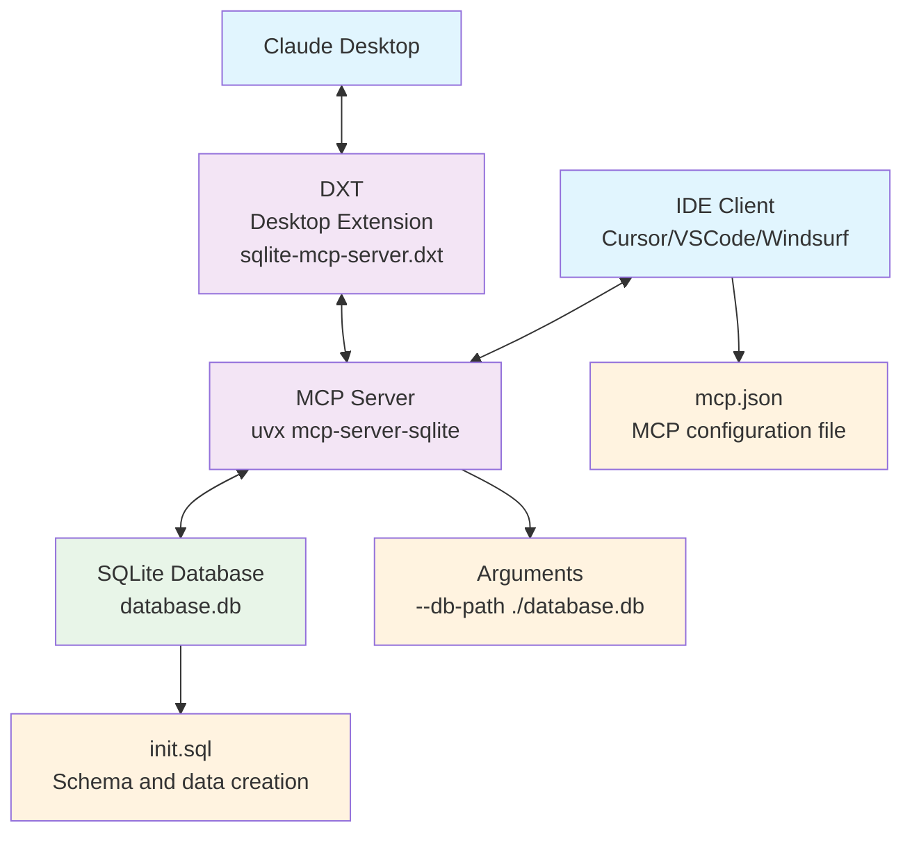

# Design Document: SQLite MCP Server

## 1. Overview

This document explains the design decisions and technical choices for a SQLite-based Model Context Protocol (MCP) server that provides a reliable development and testing foundation while minimizing local environment contamination.

## 2. Problem Statement

### 2.1 Background

Developers need to test and validate MCP server functionality in local development environments without creating long-term dependencies in system configurations or contaminating their environment.

### 2.2 Requirements

- Minimize impact on local environment
- Easy setup and removal
- No persistent system-level dependencies
- Compatibility with popular IDEs (Cursor, VS Code, Windsurf)
- Self-contained database solution
- Reproducibility across different development environments

## 3. Design Goals

### 3.1 Primary Goals

1. **Environment Isolation**: Minimize impact on local development environment
2. **Zero Installation Footprint**: Avoid installing persistent dependencies
3. **Portability**: Ensure consistent behavior across different systems
4. **Simplicity**: Reduce complexity of setup and maintenance
5. **Chat-based AI Integration**: Enable functionality verification with Claude Desktop extensions

### 3.2 Secondary Goals

1. **IDE Integration**: Seamless integration with modern code editors
2. **Database Persistence**: Maintain data across sessions for testing purposes
3. **Documentation**: Clear setup and usage instructions

## 4. Technical Decisions

### 4.1 Database Choice: SQLite

**Decision**: Use SQLite as the primary database solution

**Rationale**:

- **File-based**: No database server installation required
- **Portability**: Easy to manage and version control as a single file
- **Zero configuration**: Works immediately without setup
- **Wide support**: Excellent tooling and community support
- **Lightweight**: Minimal resource consumption
- **No communication required**: Can provide services in standalone environments

**Alternatives Considered**:

- PostgreSQL: Requires server installation and configuration
- MySQL: Complex setup and system-level dependencies
- In-memory database: Data loss between sessions

### 4.2 Package Management: uvx

**Decision**: Use uvx to execute mcp-server-sqlite

**Rationale**:

- **No global installation**: Packages are temporarily downloaded and cached
- **Version isolation**: Each project can use specific package versions
- **Automatic cleanup**: uv manages package lifecycle
- **Reduced maintenance**: No manual dependency management required

**Alternatives Considered**:

- npx: Discontinuation of `mcp-server-sqlite` distribution and difficulty in serverization of `mcp-server-sqlite-npx` in DXT
- pip install: Potential to pollute global environment
- Global uv install: Pollutes global namespace
- Docker: Adds containerization complexity
- Custom implementation: Increases maintenance burden

### 4.3 Configuration Approach

**Decision**: Provide separate configuration files for each IDE

**Rationale**:

- **IDE-specific requirements**: Different editors may require different configuration schemas
- **Flexibility**: Users can choose their preferred development environment
- **Clarity**: Explicit configuration reduces ambiguity

**Implementation**:

- `.cursor/mcp.json`: Cursor configuration
- `.vscode/mcp.json`: VS Code configuration
- `.windsurf/mcp.json`: Windsurf configuration

**Note**: MCP configuration files can be generated using the online tool at [MCP Configuration Generator](https://www.infyways.com/tools/mcp-configuration-generator/) which provides additional convenience and validation features.

## 5. Architecture

### 5.1 System Components



### 5.2 Data Flow

1. IDE loads MCP configuration file
2. IDE starts uvx process with mcp-server-sqlite
3. MCP server connects to SQLite database file
4. Client-server communication via stdio transport
5. Database operations executed on local SQLite file

**Claude Desktop Integration**:

1. Claude Desktop loads desktop extension (DXT)
2. DXT starts MCP server mcp-server-sqlite with uvx
3. Similar data flow for SQLite operations

## 6. Implementation Details

### 6.1 File Structure

```plain
mcp-tutorial-1/
├── init_ja.sql               # Initial database schema and sample data (Japanese version)
├── init.sql                  # Initial database schema and sample data (English version)
├── README.md                 # This file
├── database.db               # SQLite database file (created during initialization)
├── .gitignore                # Git exclusion settings
├── .cursor/mcp.json          # MCP configuration file (for Cursor)
├── .vscode/mcp.json          # MCP configuration file (for VS Code)
├── .windsurf/mcp.json        # MCP configuration file (for Windsurf)
├── docs/                     # Design documentation files
│   ├── DESIGN_ja.md          # Design document (Japanese)
│   └── DESIGN.md             # Design document (English)
├── dxt-src/                  # Claude Desktop DXT files
│   ├── manifest.json         # DXT manifest file
│   ├── icon.png              # DXT icon image
│   ├── index.js              # DXT main entry point
│   ├── package.json          # Package configuration for DXT
│   ├── README_ja.md          # DXT-specific documentation (Japanese)
│   └── README.md             # DXT-specific documentation (English)
└── dist/                     # Build artifacts (.dxt files)
    └── sqlite-mcp-server.dxt # Desktop extension for Claude Desktop
```

### 6.2 Configuration Schema

**IDE Configuration (Cursor example)**:

```json
{
    "mcpServers": {
        "sqlite": {
            "command": "uvx",
            "args": [
                "mcp-server-sqlite",
                "--db-path",
                "${user_config.database_path}"
            ],
            "env": {
                "UV_CACHE_DIR": "${__dirname}/.uv-cache"
            }
        }
    }
}
```

### 6.3 Database Initialization

- Optional `init_ja.sql` provides sample schema and data
- Database file creation commands provided in `README.md`
- Sample database file `database.db` excluded from version control via `.gitignore`

### 6.4 DXT Extension

- **Claude Desktop Integration**: DXT extension integrates with Claude Desktop without editing configuration files
- **User Configuration**: Users can select database file path
- **Build Process**: `npm run package` generates dxt files
- **Cross-platform**: Build scripts support Windows, macOS, and Linux

### 6.5 Security Considerations

- **File Access Restrictions**: SQLite database file access limited to local environment
- **Permission Separation**: Access only to user-specified database files
- **Sandboxed Execution**: Isolated execution environment via uvx

### 6.6 Performance Optimization

- **uvx Cache**: Fast package execution via `.uv-cache` directory
- **SQLite Optimization**: Proper indexes and query optimization
- **Memory Management**: Efficient database connection pooling
- **Asynchronous Processing**: Asynchronous communication via MCP protocol

## 7. Trade-offs and Limitations

### 7.1 Trade-offs Made

| Aspect | Chosen Approach | Trade-off |
|--------|----------------|-----------|
| Performance | SQLite file-based | Practicality and versatility |
| Dependency Management | uvx execution | Network dependency on first run |
| Configuration | Multiple config files | Generic config vs. minor duplication |
| Database Sharing | File-based storage | Concurrent access from multiple MCP servers |
| Platform Integration | IDE + Claude Desktop | Multiple configuration files required |

### 7.2 Known Limitations

1. **Network Dependency**: Internet connection required for initial uvx execution
2. **File Management**: Manual creation and deletion of database.db required when needed
3. **Single Database**: Limited to one SQLite instance per project
4. **Platform Dependency**: Requires uv runtime environment
5. **DXT Limitations**: Desktop extensions only available in Claude Desktop

## 8. Success Metrics

### 8.1 Environment Impact Metrics

- ✅ Zero global package installations
- ✅ No system service dependencies
- ✅ No persistent configuration changes
- ✅ Complete removal possible by folder deletion

### 8.2 Usability Metrics

- ✅ Setup time < 2 minutes
- ✅ Windows, macOS, Linux support
- ✅ Major IDE compatibility
- ✅ Claude Desktop integration

## 9. References

### 9.1 Technical Documentation

- [Model Context Protocol (MCP) Specification](https://modelcontextprotocol.io/)
- [SQLite Official Documentation](https://www.sqlite.org/docs.html)
- [uv Package Manager](https://docs.astral.sh/uv/)
- [Claude Desktop DXT Development Guide](https://docs.anthropic.com/claude/docs/desktop-extensions)

### 9.2 Related Projects

- [mcp-server-sqlite](https://github.com/jlowin/mcp-server-sqlite): Base MCP server
- [Cursor – Model Context Protocol (MCP)](https://docs.cursor.com/ja/context/mcp#model-context-protocol-mcp)
- [Cascade MCP Integration](https://docs.windsurf.com/windsurf/cascade/mcp)

## 10. Glossary

### 10.1 MCP Related

- **MCP (Model Context Protocol)**: Standardized communication protocol between AI models and tools
- **MCP Server**: Server application implementing MCP protocol
- **MCP Client**: Client application communicating with MCP server
- **DXT (Desktop Extension)**: Extension format for Claude Desktop
- **MCP Configuration File**: Configuration file for MCP clients to connect to MCP servers. Mainly provided as json files. Multiple MCP server connection settings can be described in one file. This name is not an official name

### 10.2 Database Related

- **SQLite**: Lightweight file-based relational database
- **Schema**: Database structure definition
- **Query**: Database inquiry
- **Transaction**: Mechanism ensuring atomicity of database operations

### 10.3 Development Tools Related

- **uvx**: Tool for temporarily executing Python packages
- **IDE (Integrated Development Environment)**: Integrated development environment
- **CLI (Command Line Interface)**: Command line interface
- **API (Application Programming Interface)**: Communication interface between applications

## 11. Conclusion

The chosen architecture successfully achieves the primary goal of minimizing environment contamination while providing a robust development platform for MCP server testing. The combination of SQLite's portability and uvx's temporary execution model creates an ideal balance between functionality and environmental cleanliness.

This design enables developers to rapidly prototype, test, and validate MCP functionality without making persistent changes to their development environment, supporting fast iteration and clean project removal. Furthermore, Claude Desktop integration provides a solution accessible to a broader user base.

---

**Document Version**: 1.0  
**Last Updated**: May 27, 2025  
**Author**: hidao80  
**Reviewer**: -
