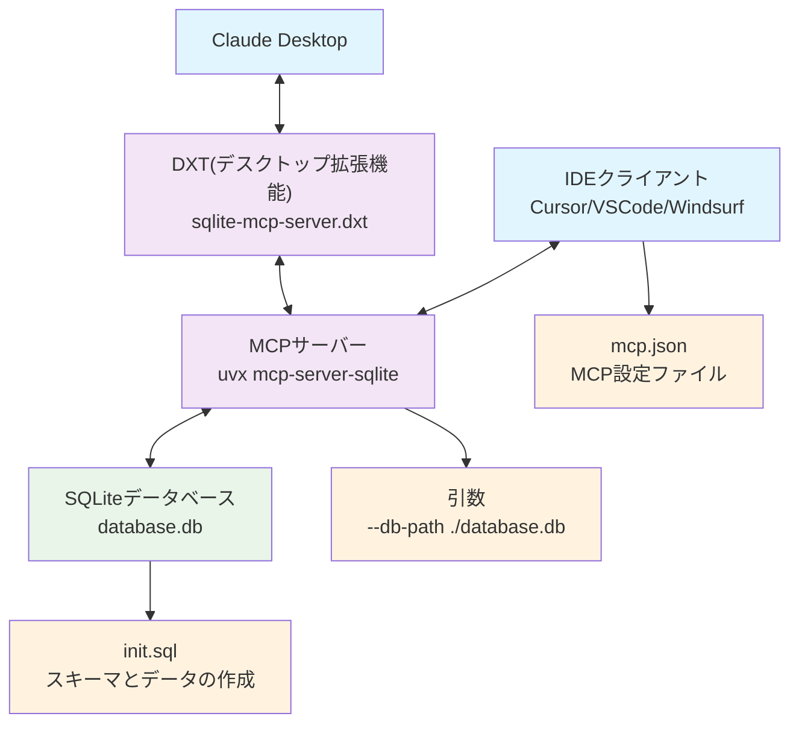

# 設計文書: SQLite MCP サーバー

## 1. 概要

この文書では、ローカル環境の汚染を最小限に抑えながら、信頼性の高い開発・テスト基盤を提供するSQLiteベースのModel Context Protocol (MCP) サーバーの設計決定と技術選択について説明します。

## 2. 問題提起

### 2.1 背景

開発者は、システム設定に長期的な依存関係を作成したり、環境を汚染したりすることなく、ローカル開発環境でMCPサーバーの機能をテストして検証する必要があります。

### 2.2 要求事項

- ローカル環境への影響を最小限に抑制
- 簡単なセットアップと削除
- 永続的なシステムレベルの依存関係を作らない
- 人気のIDE（Cursor、VS Code）との互換性
- 自己完結型のデータベースソリューション
- 異なる開発環境間での再現性

## 3. 設計目標

### 3.1 主要目標

1. **環境の分離**: ローカル開発環境への影響を最小限に抑制
2. **ゼロインストールフットプリント**: 永続的な依存関係のインストールを回避
3. **可搬性**: 異なるシステム間での一貫した動作を保証
4. **シンプルさ**: セットアップとメンテナンスの複雑さを軽減
5. **チャット型AIとの連携**: Claude Desktop用の拡張機能でも動作確認できるようにする

### 3.2 副次目標

1. **IDE統合**: モダンなコードエディターーとのシームレスな統合
2. **データベース永続性**: テスト用にセッション間でデータを維持
3. **ドキュメント**: 明確なセットアップと使用方法の説明

## 4. 技術的決定

### 4.1 データベース選択: SQLite

**決定**: SQLiteを主要なデータベースソリューションとして使用

**根拠**:

- **ファイルベース**: データベースサーバーのインストールが不要
- **可搬性**: 単一ファイルで簡単に管理・バージョン管理可能
- **ゼロ設定**: セットアップなしで即座に動作
- **広範囲なサポート**: 優れたツールとコミュニティサポート
- **軽量**: 最小限のリソース消費
- **通信なし**: スタンドアロン環境でもサービスを提供できる

**検討した代替案**:

- PostgreSQL: サーバーのインストールと設定が必要
- MySQL: 複雑なセットアップとシステムレベルの依存関係
- インメモリデータベース: セッション間でのデータ損失

### 4.2 パッケージ管理: uvx

**決定**: mcp-server-sqliteの実行にuvxを使用

**根拠**:

- **グローバルインストール不要**: パッケージは一時的にダウンロード・キャッシュされる
- **バージョン分離**: 各プロジェクトで特定のパッケージバージョンを使用可能
- **自動クリーンアップ**: uvがパッケージのライフサイクルを管理
- **メンテナンス軽減**: 手動での依存関係管理が不要

**検討した代替案**:

- npx: `mcp-server-sqlite`の配布停止と`mcp-server-sqlite-npx`がDXTにおいてサーバー化が困難
- pip install: グローバル環境を汚染する可能性
- グローバルuvインストール: グローバル名前空間を汚染
- Docker: コンテナー化の複雑さを追加
- カスタム実装: メンテナンス負荷の増加

### 4.3 設定アプローチ

**決定**: 各IDEに個別の設定ファイルを提供

**根拠**:

- **IDE固有の要求事項**: エディター毎に異なる設定スキーマが必要な場合がある
- **柔軟性**: ユーザーが好みの開発環境を選択可能
- **明確性**: 明示的な設定により曖昧さを軽減

**実装**:

- `.cursor/mcp.json`: Cursor設定
- `.vscode/mcp.json`: VS Code設定
- `.windsurf/mcp.json`: Windsurf設定

**備考**: MCP設定ファイルは、[MCP Configuration Generator](https://www.infyways.com/tools/mcp-configuration-generator/)のオンラインツールを使用して生成することができ、追加の利便性と検証機能を提供します。

## 5. アーキテクチャ

### 5.1 システムコンポーネント



### 5.2 データフロー

1. IDEがMCP設定ファイルを読み込み
2. IDEがuvxでMCPサーバーmcp-server-sqliteを起動
3. MCPサーバーがSQLiteデータベースファイルに接続
4. stdioトランスポート経由でクライアント・サーバー間通信
5. ローカルSQLiteファイルでデータベース操作を実行

**Claude Desktop統合**:

1. Claude Desktopがデスクトップ拡張機能（DXT）を読み込み
2. DXTがuvxでMCPサーバーmcp-server-sqliteを起動
3. 同様のデータフローでSQLite操作を実行

## 6. 実装詳細

### 6.1 ファイル構成

```plain
mcp-tutorial-1/
├── init_ja.sql               # 初期データベーススキーマとサンプルデータ（日本語版）
├── init.sql                  # 初期データベーススキーマとサンプルデータ（英語版）
├── README.md                 # このファイル
├── database.db               # SQLiteデータベースファイル（初期化時に作成）
├── .gitignore                # Git除外設定
├── .cursor/mcp.json          # MCP設定ファイル（Cursor用）
├── .vscode/mcp.json          # MCP設定ファイル（VS Code用）
├── .windsurf/mcp.json        # MCP設定ファイル（Windsurf用）
├── docs/                     # 設計ドキュメントファイル群
│   ├── DESIGN_ja.md          # 設計ドキュメント（日本語）
│   └── DESIGN.md             # 設計ドキュメント（英語）
├── dxt-src/                  # Claude Desktop用DXTファイル群
│   ├── manifest.json         # DXTマニフェストファイル
│   ├── icon.png              # DXTアイコン画像
│   ├── index.js              # DXTメインエントリーポイント
│   ├── package.json          # DXT用パッケージ設定
│   ├── README_ja.md          # DXT固有のドキュメント（日本語）
│   └── README.md             # DXT固有のドキュメント（英語）
└── dist/                     # ビルド成果物（.dxtファイル）
    └── sqlite-mcp-server.dxt # Claude Desktop用デスクトップ拡張機能
```

### 6.2 設定スキーマ

**IDE設定（Cursorの例）**:

```json
{
    "mcpServers": {
        "sqlite": {
            "command": "uvx",
            "args": [
                "mcp-server-sqlite",
                "--db-path",
                "${user_config.database_path}"
            ],
            "env": {
                "UV_CACHE_DIR": "${__dirname}/.uv-cache"
            }
        }
    }
}
```

### 6.3 データベース初期化

- オプションの`init_ja.sql`でサンプルスキーマとデータを提供
- データベースファイルの作成コマンドは`README.md`にて提供
- サンプルのデータベースファイル`database.db`は`.gitignore`でバージョン管理から除外

### 6.4 DXT拡張機能

- **Claude Desktop統合**: DXT拡張機能として設定ファイルを編集せずにClaude Desktopに統合
- **ユーザー設定**: データベースファイルパスをユーザーが選択可能
- **ビルドプロセス**: `npm run package`でdxtファイルを生成
- **クロスプラットフォーム**: Windows、macOS、Linux対応のビルドスクリプト

### 6.5 セキュリティ考慮事項

- **ファイルアクセス制限**: SQLiteデータベースファイルへのアクセスはローカル環境のみ
- **権限分離**: ユーザーが指定したデータベースファイルのみにアクセス
- **サンドボックス実行**: uvxによる分離された実行環境

### 6.6 パフォーマンス最適化

- **uvxキャッシュ**: `.uv-cache`ディレクトリによる高速なパッケージ実行
- **SQLite最適化**: 適切なインデックスとクエリ最適化
- **メモリ管理**: 効率的なデータベース接続プール
- **非同期処理**: MCPプロトコルによる非同期通信

## 7. トレードオフと制限事項

### 7.1 行ったトレードオフ

| 側面 | 選択したアプローチ | トレードオフ |
|------|------------------|-------------|
| パフォーマンス | SQLiteファイルベース | 実用性と汎用性 |
| 依存関係管理 | uvx実行 | 初回実行時のネットワーク依存 |
| 設定 | 複数の設定ファイル | 汎用設定vs軽微な重複 |
| データベースの共有 | ファイルベースストレージ | 複数MCPサーバーからの同時アクセス |
| プラットフォーム統合 | IDE + Claude Desktop | 複数の設定ファイルが必要 |

### 7.2 既知の制限事項

1. **ネットワーク依存**: 初回uvx実行時にインターネット接続が必要
2. **ファイル管理**: 必要に応じてdatabase.dbを手動で作成および削除する必要
3. **単一データベース**: プロジェクトあたり1つのSQLiteインスタンスに限定
4. **プラットフォーム依存**: uvランタイム環境が必要
5. **DXT制限**: デスクトップ拡張機能はClaude Desktopでのみ利用可能

## 8. 成功指標

### 8.1 環境影響指標

- ✅ グローバルパッケージインストールゼロ
- ✅ システムサービス依存関係なし
- ✅ 永続的な設定変更なし
- ✅ フォルダー削除で完全な除去が可能

### 8.2 使いやすさ指標

- ✅ セットアップ時間 < 2分
- ✅ Windows、macOS、Linux対応
- ✅ 主要IDE互換性
- ✅ Claude Desktop統合

## 9. 参考資料

### 9.1 技術文書

- [Model Context Protocol (MCP) 仕様](https://modelcontextprotocol.io/)
- [SQLite 公式ドキュメント](https://www.sqlite.org/docs.html)
- [uv パッケージマネージャー](https://docs.astral.sh/uv/)
- [Claude Desktop DXT 開発ガイド](https://docs.anthropic.com/claude/docs/desktop-extensions)

### 9.2 関連プロジェクト

- [mcp-server-sqlite](https://github.com/jlowin/mcp-server-sqlite): ベースとなるMCPサーバー
- [Cursor – Model Context Protocol (MCP)](https://docs.cursor.com/ja/context/mcp#model-context-protocol-mcp)
- [Cascade MCP Integration](https://docs.windsurf.com/windsurf/cascade/mcp)

## 10. 用語集

### 10.1 MCP関連

- **MCP (Model Context Protocol)**: AIモデルとツール間の標準化された通信プロトコル
- **MCPサーバー**: MCPプロトコルを実装するサーバーアプリケーション
- **MCPクライアント**: MCPサーバーと通信するクライアントアプリケーション
- **DXT (Desktop Extension)**: Claude Desktop用の拡張機能形式
- **MCP設定ファイル**: MCPクライアントがMCPサーバーと接続するための設定ファイル。主にjsonファイルで提供される。1ファイルに複数MCPサーバーとの接続設定を記述する。この名前は正式名称ではない

### 10.2 データベース関連

- **SQLite**: 軽量なファイルベースのリレーショナルデータベース
- **スキーマ**: データベースの構造定義
- **クエリ**: データベースに対する問い合わせ
- **トランザクション**: データベース操作の原子性を保証する仕組み

### 10.3 開発ツール関連

- **uvx**: Pythonパッケージを一時的に実行するツール
- **IDE (Integrated Development Environment)**: 統合開発環境
- **CLI (Command Line Interface)**: コマンドラインインターフェイス
- **API (Application Programming Interface)**: アプリケーション間の通信インターフェイス

## 11. 結論

選択したアーキテクチャは、MCPサーバー動作確認用の簡易な開発プラットフォームを提供しながら、環境汚染の最小化という主要目標を成功裏に達成しています。SQLiteの可搬性とuvxの一時実行モデルの組み合わせにより、機能性と環境のクリーンさの理想的なバランスが実現されています。

この設計により、開発者は開発環境に永続的な変更を加えることなく、MCP機能を迅速にプロトタイプ化、テスト、検証でき、高速な反復とクリーンなプロジェクト削除をサポートします。さらに、Claude Desktop統合により、より広範なユーザーベースにアクセス可能なソリューションを提供しています。

---

**文書バージョン**: 1.0  
**最終更新**: 2025年5月27日  
**作成者**: hidao80  
**レビュー者**: -
